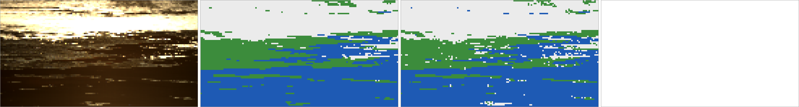

# The framework: from a HYPSO capture to a class map on the FPGA

This repository takes a trained PyTorch network, turns it into an FPGA
accelerator on the ZCU104, feeds it real HYPSO-2 captures and checks every
answer it gives. This page shows what exists, how the pieces connect, where
data is read and written, and how to run each step.

**Status (2026-09-28).** The whole chain has run on real data. For the
`aegantsea1` capture (every 8th row and column, 10,275 pixels), the FPGA
matched the reference on every pixel (worst logit difference 1.9e-5) and
scored 96.6 % accuracy, mIoU 0.927 against the hand labels, identical to
the PC reference. See `aegean/overview.png`.



*Left to right: the capture (RGB bands), the labels, what the FPGA
classified (white cloud, green land, blue sea), and where the FPGA differs
from the reference (white = nowhere).*

---

## 1. What was built

| Piece | Where | What it is |
| --- | --- | --- |
| Accelerator | `src/hls/justoliunet/` | HLS C++ kernel: raw spectrum in, 3 class scores out |
| Its constants | `justoliunet_weights.hpp` | Band selection, training mean/std, network weights; generated |
| Exporter | `tools/export_justoliunet.py` | Checkpoint + `mu_sd.txt` → that header + test vectors |
| Build flow | `main.py`, `scripts/`, `boards/zcu104/system.tcl` | C++ → RTL → IP → block design → bitstream |
| Board driver + notebook | `software/pynq/justoliunet/` | Loads the design and drives the kernel from Jupyter on the board (PYNQ) |
| PYNQ package | `artifacts/justoliunet/<build>/pynq/` + `.zip` | Everything the notebook needs, made by every bitstream build |
| JTAG driver (fallback) | `software/jtag/` | Program and drive the board from the server over JTAG (`xsdb`) |
| Image tool | `tools/justoliunet_image.py` | Capture → pixels for the board; FPGA answers → scores + pictures |
| Commands | `fpga.sh` | One sourceable file with every step as a command |
| Checks | `tb/`, `tests/` | C++ testbench, 75 Python tests, simulated boards |

The network is **1D-Justo-LiuNet**: it classifies each pixel as cloud (0),
land (1) or sea (2) from its spectrum alone, the same model that runs on
HYPSO-1. Everything in the kernel is float32, so it computes what the
trained model computes.

---

## 2. What it looks like in hardware

```text
 ZCU104 board
 ┌──────────────────────────────────────────────────────────────────────────┐
 │  Processing system (PS): 4 x ARM Cortex-A53, DDR, SD card, JTAG debug      │
 │     │                                                                      │
 │     │ M_AXI_HPM0_FPD  (the PS's memory-mapped port into the FPGA fabric)    │
 │     ▼                                                                      │
 │  AXI SmartConnect ──────────────► justoliunet kernel  (FPGA fabric, 100 MHz)│
 │                                     ├ s_axi_control: registers at 0xA000_0000│
 │  pl_clk0 (100 MHz) and reset ──────►│                                       │
 │                                     └ interrupt → PS (not used; we poll)     │
 └──────────────────────────────────────────────────────────────────────────┘
```

`boards/zcu104/system.tcl` generates this block design from scratch in
every build. To software, the kernel is a small block of memory at
`0xA000_0000` (the exact address is in the build's `board/address.tcl`):

| Register (offsets in the build's `board/xjustoliunet_hw.h`) | Direction | Content |
| --- | --- | --- |
| `AP_CTRL` (offset 0) | write bit 0 / read bits 1, 2 | start / done (clears when read) / idle |
| `spectrum` | written by software | 120 float32 words: one pixel's raw L1a spectrum |
| `logits` | read by software | 3 float32 words: the scores for cloud, land, sea |

Inside the kernel, one call processes one pixel:

```text
 spectrum[120]  raw L1a counts
      │
      ▼  preprocess          keep bands 8..117 (drop 0-7, 118-119)          → 110 values
      │                      z-score: (x - mean[b]) * (1 / std[b])            (training's mu_sd.txt)
      ▼  conv1 k=6 → ReLU → max-pool 2      1 → 6 channels,  110 → 52 long
      ▼  conv2 k=6 → ReLU → max-pool 2      6 → 12 channels,  52 → 23
      ▼  conv3 k=6 → ReLU → max-pool 2     12 → 18 channels,  23 → 9
      ▼  conv4 k=6 → ReLU → max-pool 2     18 → 24 channels,   9 → 2
      ▼  flatten (channel-major) → dense 48 → 3
 logits[3]      highest = class (0 cloud, 1 land, 2 sea)
```

Weights and statistics are baked into the bitstream as on-chip ROM
(4,563 parameters plus 3 x 110 preprocessing constants). Changing the
checkpoint or `mu_sd.txt` means re-exporting and rebuilding.

---

## 3. The build chain: from checkpoint to bitstream

```text
 weights/fp32/.../justoliunet_...K110.pt   (PyTorch checkpoint, read without torch)
 mu_sd.txt                                (per-band mean/std, from the training data prep)
        │
        ▼  tools/export_justoliunet.py --mu-sd mu_sd.txt
 src/hls/justoliunet/justoliunet_weights.hpp   + tb/data/justoliunet_vectors.txt (15 test pixels
        │                                         with the logits the numpy reference expects)
        ▼  main.py native / csim       C++ against those expected logits (PC, no FPGA)
        ▼  main.py csynth → export     HLS: C++ → Verilog → IP block
        ▼  main.py bitstream           Vivado: system.tcl block design, synthesis, place & route
 artifacts/justoliunet/<build>/
        ├ bitstream/system_wrapper.bit     the FPGA configuration
        ├ hardware/system.xsa              full hardware description
        ├ board/                           what the drivers need:
        │   ├ psu_init.tcl                 PS start-up (clock, resets) for JTAG mode
        │   ├ xjustoliunet_hw.h            register offsets
        │   ├ address.tcl                  where the kernel sits (0xA000_0000)
        │   └ system.hwh                   block design description
        ├ pynq/                            everything for the notebook, in one place:
        │   ├ justoliunet.bit, justoliunet.hwh   the design (same name, as PYNQ requires)
        │   ├ xjustoliunet_hw.h            register offsets
        │   ├ justoliunet_pynq.py, justoliunet.ipynb   driver and notebook
        │   └ justoliunet_vectors.txt, justoliunet_image.py, ...   self-test data, scoring
        └ justoliunet_pynq.zip             the same, as one file to upload
```

The architecture was checked against the training code
(`hypso-onboard-segmentation/model_definition/JustoLiuNet.py`): same layer
order, same flatten order. The preprocessing matches
`dataset_processing/prepare_hypso_dataset.py`: same dropped bands, same
z-score, same label remapping.

---

## 4. The data path: how an image is read, classified and written back

```text
 PC / server (numpy)                           board: Jupyter notebook (PYNQ)
 ─────────────────────                         ──────────────────────────────
 CAPTURE-l1a.nc  ─┐
 _labels.npy     ─┤ justoliunet_image.py prepare
                  │  read L1a cube (hypso), 598 x 1092 x 120
                  │  crop / every Nth pixel
                  ▼
 DIR/pixels.txt          120 raw values per pixel ─┐
 DIR/reference_logits.npy  what the kernel should answer
 DIR/labels.npy          classes from the hand labels
 DIR/capture_rgb.png     the input, to look at      │  fpga_zip DIR, upload DIR.zip
                                                    ▼
                                           jl.classify_folder('DIR.zip')
                                            for each pixel: write it into `spectrum`,
                                            start, wait for done, read `logits`
                                                    │
                                                    ▼
                                           DIR/fpga_logits.txt   3 scores per pixel
                                                    │
                                                    ▼
                                           justoliunet_image.py compare DIR
                                            FPGA vs reference: every pixel within 1e-4?
                                            FPGA vs labels: accuracy, IoU per class
                                            DIR/overview.png, fpga_classes.png, mismatch.png
```

The board only ever sees raw spectra and returns scores. Everything they
are checked against is computed beforehand, on the PC, from the same
checkpoint and statistics that went into the bitstream. `compare` runs in
the notebook, or on the PC once `fpga_logits.txt` is copied back.

Files in an image folder (`DIR`):

| File | Written by | Content |
| --- | --- | --- |
| `pixels.txt` | prepare | `# N pixels ...` header, then N lines of 120 raw values |
| `meta.json` | prepare | source, crop/step, map size, checkpoint |
| `reference_logits.npy` | prepare | expected 3 scores per pixel (numpy model of the kernel) |
| `labels.npy` | prepare | label per pixel (remapped like training) |
| `capture_rgb.png`, `capture_labels.png`, `rgb.png` | prepare | the input, whole capture and sampled |
| `fpga_logits.txt` | the board | 3 scores per pixel, same order as `pixels.txt` |
| `overview.png`, `fpga_classes.png`, `mismatch.png`, ... | compare | the results as pictures |

---

## 5. Driving the board

The same register traffic can come from two places.

### With PYNQ, from a Jupyter notebook on the board (the normal way)

```text
 laptop browser ──► Jupyter on the board (http://BOARD:9090)
                     justoliunet.ipynb ─► justoliunet_pynq.py ─► PYNQ MMIO ─► HPM0 ─► kernel registers
                                          Overlay('justoliunet.bit')  loads the design
```

The board boots PYNQ (Linux) from its SD card. `Overlay` programs the FPGA
with `justoliunet.bit` and uses `justoliunet.hwh` to set the 100 MHz clock
and the PS-to-FPGA port, so the `.bit` and `.hwh` must sit side by side with
the same name. That's why every build packages them into `pynq/`. The
driver finds the kernel in the design, takes the register offsets from
`xjustoliunet_hw.h`, and does one register round trip per pixel from
Python.

To use a build: `fpga_pynq` (or just `fpga_build`, which does it too), upload
`justoliunet_pynq.zip` in Jupyter, run `!unzip -o justoliunet_pynq.zip` in a
cell, open `justoliunet_pynq/justoliunet.ipynb` and run it from the top:

1. load the design, check the kernel is idle;
2. self-test: 15 known pixels, all must pass;
3. one pixel by hand;
4. a whole image (`DIR.zip` uploaded next to it), then `compare` and the overview picture;
5. the input: the capture, and one pixel's spectrum with its class;
6. speed: milliseconds per pixel.

### Over JTAG, from the server (fallback)

```text
 server ── USB JTAG cable ──► PS debug port ──► HPM0 ──► kernel registers
  xsdb (ships with Vivado)
```

For when the board runs no Linux (boot switches on JTAG, SW6 all ON).
`xsdb` resets the board, loads the bitstream, runs `psu_init` so the FPGA
gets its clock and the PS-to-FPGA port opens, then reads and writes the
kernel's registers through the debug port. This is how the first
`aegantsea1` run was done: `fpga_selftest`, `fpga_shell`, `fpga_classify DIR`.

---

## 6. How each step is verified

| Level | Command | Compares | Status |
| --- | --- | --- | --- |
| Model | (by construction) | numpy reference ↔ training code, layer by layer | checked by reading `JustoLiuNet.py` |
| C++ | `fpga_test` | kernel C++ ↔ numpy reference, 15 pixels | passes, error ≤ 5e-6 |
| HLS C sim | `main.py csim` | same, inside Vitis HLS | passes |
| RTL | `main.py cosim` | generated Verilog ↔ C++ (slow; skipped in `fpga_build`) | optional |
| Board | notebook section 2 (`jl.selftest()`) | FPGA ↔ expected logits, 15 pixels, incl. band selection | run after every build |
| Image | notebook section 4 (`compare`) | FPGA ↔ reference on every pixel, and ↔ labels | 10,275/10,275 match, 96.6 % (over JTAG) |

The test pixels carry a huge value in the dropped bands, so a wrong band
selection fails loudly: deliberately breaking it gives logit errors around
30,000. The numpy reference is not PyTorch itself. Running the checkpoint in
PyTorch on `tb/data/justoliunet_vectors.txt` would close that last gap.

---

## 7. Running it: `fpga.sh`

```bash
source fpga.sh        # once per terminal; then:
fpga_help
```

| Goal | Commands |
| --- | --- |
| Tools on PATH | `fpga_env` (or `fpga_env /path/to/settings64.sh`) |
| Test on the PC (simulation) | `fpga_test` |
| Weights of any trained model as C++ arrays | `fpga_weights` (all of `weights/`) or `fpga_weights weights/fp32/sp_unet_small` |
| The same, quantized to int8 | `fpga_quantize` (options: `--bits 16`, `--per-channel`, `--scale float`) |
| Build | `fpga_build`, then `fpga_runs` to see the builds |
| Files for the board | `fpga_pynq`: the newest build's `pynq/` folder and `justoliunet_pynq.zip` |
| Is the board OK? Talk to it | the notebook: sections 1 to 3 |
| Classify an image | `fpga_prepare CAPTURE.nc --labels LABELS.npy --step 8 --out DIR`, `fpga_zip DIR`, notebook section 4 |
| Look at the pictures | in the notebook, or `fpga_view DIR` / copy `DIR/*.png` |
| Without Linux on the board | `fpga_selftest`, `fpga_shell`, `fpga_classify DIR` (JTAG) |

Commands that need a build use the newest one unless given one:
`fpga_pynq justoliunet 2026-09-25_16-40-12-bitstream`.

---

## 8. Limits, and what comes next

- **Speed.** One pixel per call, computed one multiply at a time in
  float32, with a round trip per pixel. Fine for proving correctness, far
  from real time: a whole capture is about 650,000 pixels.
- **Next: throughput.** Stream pixels through a pipelined, parallel
  datapath (AXI-Stream in and out) fed by a DMA from DDR, so the processor
  only hands over whole images. The image tool and the self-test stay
  as they are, as the correctness check for the fast version.
- **Next: fixed point.** int8/int16 with quantization-aware-trained weights
  (`weights/qat/`) instead of float32: far less hardware per operation.
- **The PYNQ notebook** is tested against a simulated overlay
  (`tests/test_pynq.py`); its first run on the board is still to come.
